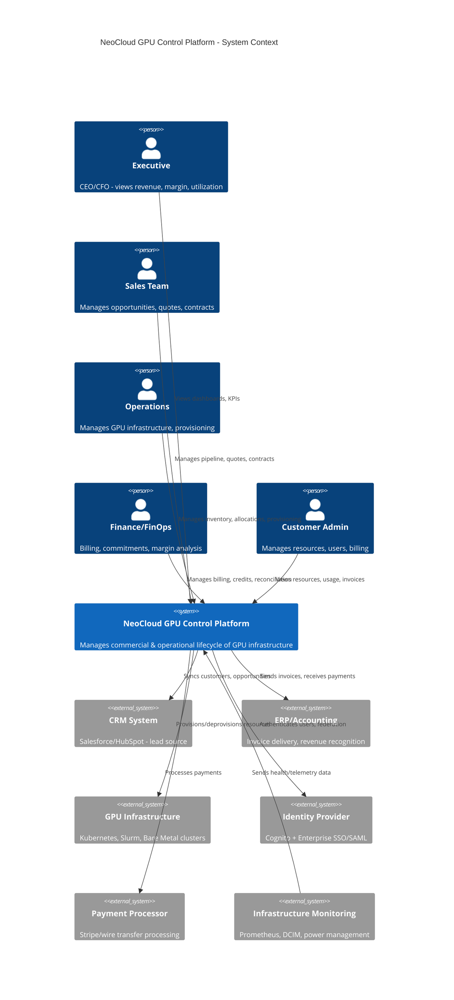
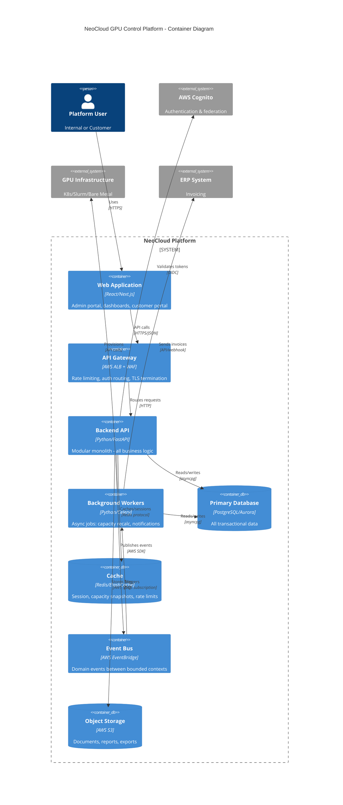
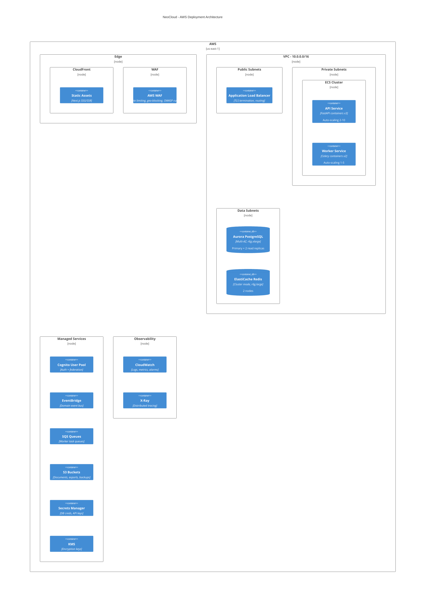
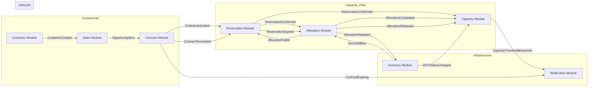
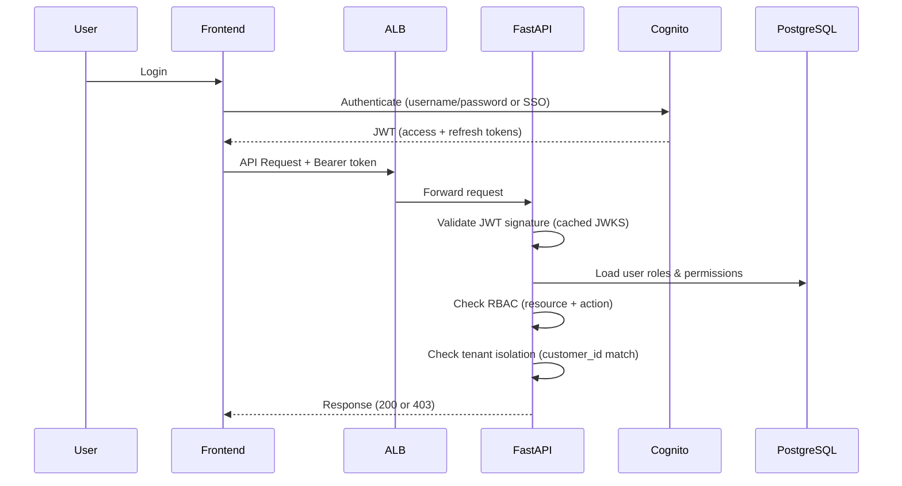
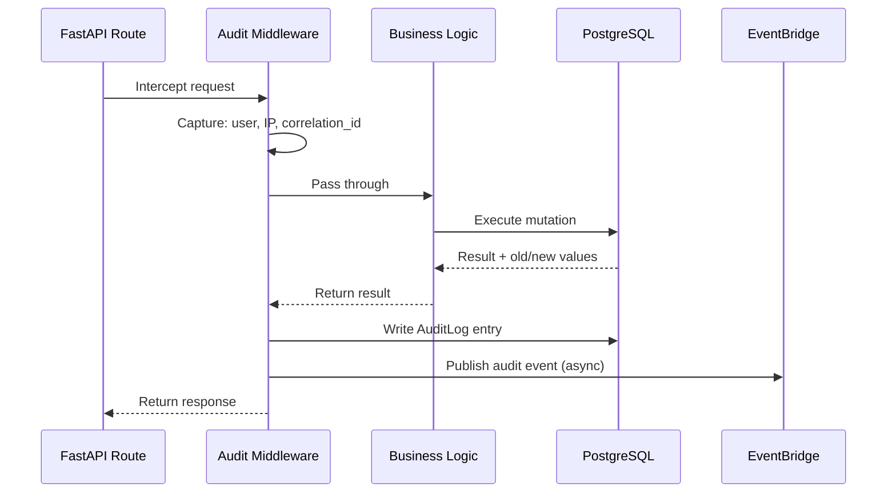

# NeoCloud GPU Control Platform — C4 Architecture Diagrams

## Level 1: System Context



---

## Level 2: Container Diagram



---

## Level 3: Component Diagram (Backend Modular Monolith)

```mermaid
C4Component
    title NeoCloud Backend - Bounded Contexts (Modular Monolith)

    Container_Boundary(backend, "Backend API - FastAPI") {

        Component(customers, "Customer Module", "Bounded Context", "Customer CRUD, contacts, billing accounts, hierarchy")
        Component(catalog, "Catalog & Pricing Module", "Bounded Context", "SKUs, price books, pricing models, rate cards")
        Component(sales, "Sales Module", "Bounded Context", "Opportunities, capacity checks, quotes")
        Component(contracts, "Contract Module", "Bounded Context", "Contracts, items, commitments, SLA, pricing agreements")
        Component(inventory, "Inventory Module", "Bounded Context", "Regions, DCs, clusters, racks, servers, GPUs")
        Component(capacity, "Capacity Module", "Bounded Context", "Capacity ledger, availability, incoming, overselling control")
        Component(reservations, "Reservation Module", "Bounded Context", "Reservation lifecycle, conflict detection")
        Component(allocations, "Allocation Module", "Bounded Context", "Physical resource binding, replacement")
        Component(iam, "IAM Module", "Bounded Context", "Users, roles, permissions, RBAC enforcement")
        Component(audit, "Audit Module", "Cross-cutting", "Audit trail, change logging")
        Component(dashboards, "Dashboard Module", "Read Model", "Aggregated views, KPIs, executive reports")
        Component(notifications, "Notification Module", "Cross-cutting", "Email, webhook, in-app notifications")
        Component(common, "Common/Shared", "Infrastructure", "DB, cache, auth middleware, event bus client")
    }

    ContainerDb(db, "PostgreSQL", "Aurora")
    Container(events, "EventBridge", "Event Bus")
    ContainerDb(cache, "Redis", "ElastiCache")

    Rel(customers, db, "CRUD")
    Rel(catalog, db, "CRUD")
    Rel(sales, db, "CRUD")
    Rel(contracts, db, "CRUD")
    Rel(inventory, db, "CRUD")
    Rel(capacity, db, "Ledger writes")
    Rel(reservations, db, "CRUD")
    Rel(allocations, db, "CRUD")
    Rel(dashboards, db, "Read-only queries")
    Rel(dashboards, cache, "Cached aggregates")

    Rel(sales, capacity, "Checks availability")
    Rel(contracts, reservations, "Creates reservations")
    Rel(reservations, capacity, "Updates ledger")
    Rel(reservations, allocations, "Triggers allocation")
    Rel(allocations, inventory, "Binds to GPUs")
    Rel(allocations, capacity, "Updates ledger")

    Rel(contracts, events, "ContractActivated")
    Rel(reservations, events, "ReservationConfirmed")
    Rel(allocations, events, "AllocationCompleted")
    Rel(inventory, events, "GPUStatusChanged")
    Rel(capacity, events, "CapacityChanged")
```



---

## Deployment Diagram



---

## Domain Event Catalog

### Event Flow Between Bounded Contexts



### Event Definitions

| Event | Source | Consumers | Payload |
|-------|--------|-----------|---------|
| `CustomerCreated` | Customer | Sales, Notifications | `{customer_id, name, account_owner_id}` |
| `CustomerStatusChanged` | Customer | Contracts, Sales | `{customer_id, old_status, new_status}` |
| `OpportunityStageChanged` | Sales | Notifications, Dashboards | `{opportunity_id, customer_id, old_stage, new_stage, expected_mrr}` |
| `OpportunityWon` | Sales | Contracts | `{opportunity_id, customer_id, quote_id}` |
| `CapacityCheckCompleted` | Sales | Dashboards | `{check_id, opportunity_id, result, gap}` |
| `QuoteAccepted` | Sales | Contracts | `{quote_id, opportunity_id, customer_id}` |
| `ContractActivated` | Contracts | Reservations, Capacity, Notifications | `{contract_id, customer_id, items[], start_date}` |
| `ContractExpiring` | Contracts | Notifications, Sales | `{contract_id, customer_id, end_date, days_remaining}` |
| `ContractTerminated` | Contracts | Reservations, Allocations, Capacity | `{contract_id, customer_id, reason, effective_date}` |
| `ContractAmended` | Contracts | Reservations, Capacity | `{contract_id, changes[]}` |
| `ReservationCreated` | Reservations | Capacity, Notifications | `{reservation_id, contract_id, gpu_model, quantity, region}` |
| `ReservationConfirmed` | Reservations | Allocations, Capacity | `{reservation_id, contract_id, gpu_model, quantity}` |
| `ReservationExpired` | Reservations | Allocations, Capacity | `{reservation_id, contract_id}` |
| `ReservationCancelled` | Reservations | Capacity, Notifications | `{reservation_id, contract_id, reason}` |
| `AllocationRequested` | Allocations | Inventory | `{allocation_id, reservation_id, gpu_model, quantity, cluster_id}` |
| `AllocationCompleted` | Allocations | Capacity, Notifications, Dashboards | `{allocation_id, reservation_id, gpu_ids[], server_ids[]}` |
| `AllocationFailed` | Allocations | Reservations, Notifications | `{allocation_id, reservation_id, reason}` |
| `AllocationReleased` | Allocations | Capacity, Inventory | `{allocation_id, gpu_ids[], reason}` |
| `GPUStatusChanged` | Inventory | Capacity, Allocations | `{gpu_id, old_status, new_status, server_id}` |
| `ServerStatusChanged` | Inventory | Capacity, Allocations | `{server_id, old_status, new_status, gpu_ids[]}` |
| `IncomingCapacityUpdated` | Capacity | Sales, Dashboards, Notifications | `{gpu_model, quantity, region, expected_date, status}` |
| `CapacityThresholdBreached` | Capacity | Notifications, Sales | `{gpu_model, region, available, threshold_pct}` |
| `CapacityOversellAttempt` | Capacity | Notifications, Sales | `{gpu_model, region, requested, available, gap}` |

### Event Bus Configuration

```yaml
# EventBridge Bus
bus_name: neocloud-domain-events

# Rules route events to SQS queues per consumer
rules:
  - name: capacity-events
    pattern:
      source: ["neocloud.reservations", "neocloud.allocations", "neocloud.inventory"]
    target: sqs://neocloud-capacity-queue

  - name: allocation-events
    pattern:
      source: ["neocloud.reservations", "neocloud.inventory"]
      detail-type: ["ReservationConfirmed", "GPUStatusChanged"]
    target: sqs://neocloud-allocation-queue

  - name: notification-events
    pattern:
      detail-type:
        - prefix: "Contract"
        - prefix: "Capacity"
        - suffix: "Failed"
    target: sqs://neocloud-notification-queue

  - name: dashboard-events
    pattern:
      source:
        - prefix: "neocloud."
    target: sqs://neocloud-dashboard-queue
```

---

## Cross-Cutting Concerns

### Authentication & Authorization Flow



### Audit Trail Flow



---

## Network Security Architecture

```
Internet
    │
    ▼
CloudFront (CDN + WAF)
    │
    ▼ (HTTPS only)
ALB (Public Subnet)
    │ Security Group: allow 443 from CloudFront IPs only
    ▼
ECS Tasks (Private Subnet)
    │ Security Group: allow from ALB SG only
    │
    ├──▶ Aurora (Data Subnet) — SG: allow 5432 from ECS SG
    ├──▶ ElastiCache (Data Subnet) — SG: allow 6379 from ECS SG
    └──▶ VPC Endpoints (S3, EventBridge, Secrets Manager, SQS)

No public IPs on any compute or data resources.
NAT Gateway for outbound (Cognito JWKS, external webhooks).
```
