# NeoCloud GPU Control Platform — ERD & Domain Model (Release 1)

## Domain Model Design Decisions

### Core Separation Principle

The most critical architectural decision is maintaining **four independent concepts**:

1. **Physical Asset** (GPU, Server, Rack) — what exists in the datacenter
2. **Commercial Capacity** — what can be sold (abstracted from hardware)
3. **Reservation / Contract** — what is committed to a customer
4. **Allocation** — the binding of a reservation to specific physical resources

This separation enables:
- Hardware replacement without contract changes
- Selling the same physical GPU under different commercial models
- Capacity planning independent of current hardware
- Billing decoupled from physical topology

### Contract as Central Entity

Every commercial relationship flows through a Contract:
```
Customer → Opportunity → Quote → Contract → Reservation → Allocation → GPU
```

### Ledger-Based Capacity

Capacity is tracked as a **ledger** (append-only entries with running totals), not as computed aggregates. This provides:
- Audit trail for every capacity change
- Point-in-time capacity reconstruction
- Conflict detection via optimistic locking on the ledger

### Entity Lifecycle States

#### GPU Operational Status
```
PROVISIONING → ONLINE → MAINTENANCE → ONLINE
                     → FAILED → DECOMMISSIONED
```

#### GPU Commercial Status
```
AVAILABLE → RESERVED → ALLOCATED → AVAILABLE
                                 → MAINTENANCE_HOLD
```

#### Contract Status
```
DRAFT → PENDING_APPROVAL → ACTIVE → EXPIRING → EXPIRED
                                   → TERMINATED
                        → AMENDMENT_PENDING → ACTIVE
```

#### Reservation Status
```
PENDING → CONFIRMED → PROVISIONING → ACTIVE → RELEASING → RELEASED
                                             → EXPIRED
       → CANCELLED
```

#### Allocation Status
```
PENDING → PROVISIONING → ACTIVE → RELEASING → RELEASED
                                → FAILED → REPLACING
```

#### Opportunity Status
```
QUALIFICATION → DISCOVERY → PROPOSAL → NEGOTIATION → CLOSED_WON
                                                    → CLOSED_LOST
```

---

## Entity-Relationship Diagram

```mermaid
erDiagram

    %% ==========================================
    %% CUSTOMER DOMAIN
    %% ==========================================

    Customer {
        uuid id PK
        string legal_name
        string trading_name
        string tax_id
        string country
        string currency
        enum status "PROSPECT|ACTIVE|SUSPENDED|CHURNED"
        enum credit_status "PENDING|APPROVED|LIMITED|BLOCKED"
        uuid parent_customer_id FK "nullable - hierarchy"
        uuid account_owner_id FK
        string industry
        jsonb metadata
        timestamp created_at
        timestamp updated_at
    }

    Contact {
        uuid id PK
        uuid customer_id FK
        string first_name
        string last_name
        string email
        string phone
        enum role "COMMERCIAL|TECHNICAL|FINANCE|BILLING|EXECUTIVE"
        boolean is_primary
        timestamp created_at
        timestamp updated_at
    }

    BillingAccount {
        uuid id PK
        uuid customer_id FK
        string name
        string billing_address_line1
        string billing_address_line2
        string billing_city
        string billing_state
        string billing_country
        string billing_postal_code
        string currency
        int payment_terms_days
        decimal credit_limit
        enum tax_config "TAXABLE|EXEMPT|REVERSE_CHARGE"
        enum invoice_preference "EMAIL|PORTAL|BOTH"
        enum status "ACTIVE|SUSPENDED|CLOSED"
        timestamp created_at
        timestamp updated_at
    }

    Customer ||--o{ Contact : "has"
    Customer ||--o{ BillingAccount : "has"
    Customer ||--o{ Customer : "parent_of"

    %% ==========================================
    %% PRODUCT CATALOG & PRICING DOMAIN
    %% ==========================================

    SKU {
        uuid id PK
        string code "GPU-H200-SXM"
        string name
        string description
        enum category "GPU|SERVER|STORAGE|NETWORK|CLUSTER|SERVICE"
        enum gpu_model "H100_SXM|H200_SXM|B200|B300"
        enum billing_unit "GPU_HOUR|GPU_MONTH|SERVER_HOUR|SERVER_MONTH|GB_HOUR|GB_TRANSFERRED"
        jsonb specifications
        boolean is_active
        timestamp created_at
        timestamp updated_at
    }

    PriceBook {
        uuid id PK
        string name
        string description
        enum type "LIST|REGIONAL|CUSTOMER|CONTRACT|PROMOTIONAL|RESERVED|SPOT"
        string currency
        date effective_from
        date effective_to
        boolean is_active
        int priority "higher wins"
        timestamp created_at
        timestamp updated_at
    }

    PriceBookEntry {
        uuid id PK
        uuid price_book_id FK
        uuid sku_id FK
        decimal unit_price
        string currency
        decimal minimum_quantity
        decimal maximum_quantity
        string region
        uuid customer_id FK "nullable"
        uuid contract_id FK "nullable"
        timestamp created_at
        timestamp updated_at
    }

    PriceBook ||--o{ PriceBookEntry : "contains"
    SKU ||--o{ PriceBookEntry : "priced_in"

    %% ==========================================
    %% SALES DOMAIN
    %% ==========================================

    Opportunity {
        uuid id PK
        uuid customer_id FK
        uuid account_owner_id FK
        string title
        uuid sku_id FK
        int gpu_quantity
        string gpu_model
        date expected_start
        int duration_months
        enum commercial_model "HOURLY|MONTHLY|RESERVED|COMMITTED|PREPAID|SPOT"
        decimal expected_mrr
        decimal probability_pct
        enum stage "QUALIFICATION|DISCOVERY|PROPOSAL|NEGOTIATION|CLOSED_WON|CLOSED_LOST"
        string region
        string notes
        date expected_close_date
        timestamp created_at
        timestamp updated_at
    }

    CapacityCheck {
        uuid id PK
        uuid opportunity_id FK
        uuid requested_by_id FK
        string gpu_model
        int quantity_requested
        string region
        date period_start
        date period_end
        int available_now
        int reserved_current
        int incoming_capacity
        enum result "AVAILABLE|PARTIALLY_AVAILABLE|UNAVAILABLE"
        int capacity_gap
        date full_capacity_date
        jsonb details
        timestamp checked_at
    }

    Quote {
        uuid id PK
        uuid opportunity_id FK
        uuid customer_id FK
        uuid prepared_by_id FK
        string quote_number
        enum status "DRAFT|SENT|ACCEPTED|REJECTED|EXPIRED"
        date valid_until
        decimal total_amount
        string currency
        int term_months
        decimal discount_pct
        string sla_tier
        text commercial_terms
        text notes
        timestamp created_at
        timestamp updated_at
    }

    QuoteItem {
        uuid id PK
        uuid quote_id FK
        uuid sku_id FK
        int quantity
        decimal unit_price
        decimal discount_pct
        decimal line_total
        string description
        timestamp created_at
    }

    Customer ||--o{ Opportunity : "has"
    Opportunity ||--o{ CapacityCheck : "checked_by"
    Opportunity ||--o{ Quote : "generates"
    Quote ||--o{ QuoteItem : "contains"
    SKU ||--o{ QuoteItem : "referenced_in"

    %% ==========================================
    %% CONTRACT DOMAIN
    %% ==========================================

    Contract {
        uuid id PK
        uuid customer_id FK
        uuid billing_account_id FK
        uuid quote_id FK "nullable"
        string contract_number
        enum status "DRAFT|PENDING_APPROVAL|ACTIVE|EXPIRING|EXPIRED|TERMINATED|AMENDMENT_PENDING"
        date start_date
        date end_date
        int term_months
        boolean auto_renewal
        int renewal_term_months
        int notice_period_days
        string currency
        decimal total_contract_value
        string sla_tier
        text commercial_notes
        text document_reference
        uuid signed_by_id FK
        timestamp signed_at
        timestamp created_at
        timestamp updated_at
    }

    ContractItem {
        uuid id PK
        uuid contract_id FK
        uuid sku_id FK
        int quantity
        decimal unit_price
        decimal line_value_monthly
        enum billing_model "USAGE|COMMITTED|RESERVED|PREPAID|HYBRID"
        string description
        timestamp created_at
        timestamp updated_at
    }

    Commitment {
        uuid id PK
        uuid contract_id FK
        enum type "MINIMUM_SPEND|MINIMUM_GPUS|MINIMUM_HOURS"
        decimal minimum_value
        enum period "MONTHLY|QUARTERLY|ANNUAL"
        string currency
        decimal overage_rate
        boolean rollover_unused
        timestamp created_at
        timestamp updated_at
    }

    PricingAgreement {
        uuid id PK
        uuid contract_id FK
        uuid sku_id FK
        decimal agreed_price
        string currency
        enum pricing_model "FLAT|TIERED|VOLUME|STEP"
        jsonb tiers "nullable - for tiered pricing"
        date effective_from
        date effective_to
        timestamp created_at
        timestamp updated_at
    }

    SLA {
        uuid id PK
        uuid contract_id FK
        string name
        enum tier "STANDARD|PREMIUM|ENTERPRISE"
        decimal uptime_pct
        int response_time_minutes
        int resolution_time_hours
        decimal credit_pct_per_breach
        decimal max_credit_pct
        timestamp created_at
        timestamp updated_at
    }

    Customer ||--o{ Contract : "holds"
    BillingAccount ||--o{ Contract : "billed_via"
    Quote |o--o| Contract : "converts_to"
    Contract ||--o{ ContractItem : "contains"
    Contract ||--o{ Commitment : "has"
    Contract ||--o{ PricingAgreement : "has"
    Contract ||--o{ SLA : "governed_by"
    SKU ||--o{ ContractItem : "sold_as"
    SKU ||--o{ PricingAgreement : "priced_via"

    %% ==========================================
    %% INFRASTRUCTURE INVENTORY DOMAIN
    %% ==========================================

    Region {
        uuid id PK
        string code "us-east"
        string name "US East (Miami)"
        string country
        boolean is_active
        timestamp created_at
        timestamp updated_at
    }

    Datacenter {
        uuid id PK
        uuid region_id FK
        string code "DC-MIA-01"
        string name
        string address
        string provider "owned|colocated"
        int total_power_kw
        int total_rack_units
        boolean is_active
        timestamp created_at
        timestamp updated_at
    }

    Cluster {
        uuid id PK
        uuid datacenter_id FK
        string code "H200-CLUSTER-01"
        string name
        string gpu_model
        int total_gpus
        enum network_fabric "INFINIBAND|ETHERNET|NVLINK"
        enum orchestrator "KUBERNETES|SLURM|BARE_METAL"
        boolean is_active
        timestamp created_at
        timestamp updated_at
    }

    Rack {
        uuid id PK
        uuid cluster_id FK
        string code "RACK-21"
        int position
        int total_units
        int used_units
        int power_capacity_kw
        boolean is_active
        timestamp created_at
        timestamp updated_at
    }

    Server {
        uuid id PK
        uuid rack_id FK
        string code "SRV-0042"
        string manufacturer
        string model
        string serial_number
        int gpu_count
        int cpu_cores
        int ram_gb
        int storage_tb
        enum operational_status "PROVISIONING|ONLINE|OFFLINE|MAINTENANCE|FAILED|DECOMMISSIONED"
        string os_image
        string ip_management
        date acquisition_date
        decimal acquisition_cost
        string supplier
        int warranty_months
        timestamp created_at
        timestamp updated_at
    }

    GPU {
        uuid id PK
        uuid server_id FK
        string gpu_id_code "GPU-US-FL-000342"
        string manufacturer
        string model "H200 SXM"
        int memory_gb
        string serial_number
        int slot_position
        enum operational_status "PROVISIONING|ONLINE|OFFLINE|MAINTENANCE|FAILED|DECOMMISSIONED"
        enum commercial_status "AVAILABLE|RESERVED|ALLOCATED|MAINTENANCE_HOLD"
        date acquisition_date
        decimal acquisition_cost
        string supplier
        int warranty_months
        decimal power_draw_watts
        timestamp last_health_check
        jsonb health_metrics
        timestamp created_at
        timestamp updated_at
    }

    Region ||--o{ Datacenter : "contains"
    Datacenter ||--o{ Cluster : "contains"
    Cluster ||--o{ Rack : "contains"
    Rack ||--o{ Server : "contains"
    Server ||--o{ GPU : "contains"

    %% ==========================================
    %% CAPACITY DOMAIN
    %% ==========================================

    CapacityLedgerEntry {
        uuid id PK
        string gpu_model
        string region
        uuid datacenter_id FK "nullable"
        uuid cluster_id FK "nullable"
        enum entry_type "PHYSICAL_ADD|PHYSICAL_REMOVE|OFFLINE|ONLINE|MAINTENANCE_START|MAINTENANCE_END|RESERVE|RELEASE_RESERVE|ALLOCATE|RELEASE_ALLOCATE|INCOMING_PLANNED|INCOMING_CONFIRMED|INCOMING_DELIVERED"
        int quantity_change "positive or negative"
        int running_total_physical
        int running_total_operational
        int running_total_reserved
        int running_total_allocated
        int running_total_available
        uuid reference_id "FK to reservation, allocation, PO, etc"
        string reference_type "reservation|allocation|purchase_order|maintenance"
        string reason
        uuid created_by_id FK
        timestamp created_at
    }

    IncomingCapacity {
        uuid id PK
        string gpu_model
        int quantity
        string supplier
        string purchase_order_number
        string region
        uuid datacenter_id FK "nullable"
        enum status "PLANNED|ORDERED|SHIPPED|DELIVERED|INSTALLED|OPERATIONAL"
        date expected_delivery_date
        date expected_operational_date
        date actual_delivery_date
        date actual_operational_date
        decimal total_cost
        string currency
        text notes
        timestamp created_at
        timestamp updated_at
    }

    %% ==========================================
    %% RESERVATION & ALLOCATION DOMAIN
    %% ==========================================

    Reservation {
        uuid id PK
        uuid contract_id FK
        uuid contract_item_id FK
        uuid customer_id FK
        string gpu_model
        int quantity
        string region
        uuid cluster_id FK "nullable - preferred"
        date start_date
        date end_date
        enum status "PENDING|CONFIRMED|PROVISIONING|ACTIVE|RELEASING|RELEASED|EXPIRED|CANCELLED"
        enum priority "CRITICAL|HIGH|NORMAL|LOW"
        text notes
        uuid created_by_id FK
        timestamp confirmed_at
        timestamp activated_at
        timestamp released_at
        timestamp created_at
        timestamp updated_at
    }

    Allocation {
        uuid id PK
        uuid reservation_id FK
        uuid gpu_id FK
        uuid server_id FK
        uuid cluster_id FK
        uuid customer_id FK
        uuid contract_id FK
        enum status "PENDING|PROVISIONING|ACTIVE|RELEASING|RELEASED|FAILED|REPLACING"
        timestamp allocated_at
        timestamp released_at
        uuid replaced_by_id FK "nullable - if GPU was swapped"
        string release_reason
        uuid allocated_by_id FK
        timestamp created_at
        timestamp updated_at
    }

    Contract ||--o{ Reservation : "generates"
    ContractItem ||--o{ Reservation : "reserves_for"
    Reservation ||--o{ Allocation : "fulfilled_by"
    GPU ||--o{ Allocation : "assigned_in"
    Server ||--o{ Allocation : "hosts"
    Cluster ||--o{ Allocation : "within"
    Customer ||--o{ Reservation : "holds"
    Customer ||--o{ Allocation : "uses"

    %% ==========================================
    %% IAM DOMAIN
    %% ==========================================

    User {
        uuid id PK
        string email
        string first_name
        string last_name
        string cognito_sub "external identity"
        uuid customer_id FK "nullable - for customer users"
        enum user_type "INTERNAL|CUSTOMER"
        boolean is_active
        timestamp last_login_at
        timestamp created_at
        timestamp updated_at
    }

    Role {
        uuid id PK
        string name "SUPER_ADMIN|EXECUTIVE|SALES_MANAGER|..."
        string description
        boolean is_system_role
        uuid customer_id FK "nullable - tenant-specific roles"
        timestamp created_at
        timestamp updated_at
    }

    Permission {
        uuid id PK
        string code "customer.read|contract.write|..."
        string resource
        string action
        string description
        timestamp created_at
    }

    UserRole {
        uuid id PK
        uuid user_id FK
        uuid role_id FK
        uuid granted_by_id FK
        timestamp granted_at
        timestamp revoked_at
    }

    RolePermission {
        uuid id PK
        uuid role_id FK
        uuid permission_id FK
        timestamp created_at
    }

    User ||--o{ UserRole : "assigned"
    Role ||--o{ UserRole : "grants"
    Role ||--o{ RolePermission : "includes"
    Permission ||--o{ RolePermission : "granted_via"

    %% ==========================================
    %% AUDIT DOMAIN
    %% ==========================================

    AuditLog {
        uuid id PK
        uuid user_id FK
        uuid customer_id FK "nullable - tenant context"
        string action "CREATE|UPDATE|DELETE|READ|EXECUTE"
        string entity_type
        uuid entity_id
        jsonb old_value
        jsonb new_value
        string ip_address
        string session_id
        uuid correlation_id
        string source "API|UI|SYSTEM|MIGRATION"
        timestamp created_at
    }

    User ||--o{ AuditLog : "performed"
```



---

## Relationship Summary

| From | To | Cardinality | Description |
|------|-----|-------------|-------------|
| Customer | Contact | 1:N | Customer has many contacts |
| Customer | BillingAccount | 1:N | Customer has many billing accounts |
| Customer | Customer | 1:N | Parent/child hierarchy |
| Customer | Opportunity | 1:N | Customer has many opportunities |
| Customer | Contract | 1:N | Customer holds many contracts |
| Customer | Reservation | 1:N | Customer holds reservations |
| Opportunity | CapacityCheck | 1:N | Opportunity triggers capacity checks |
| Opportunity | Quote | 1:N | Opportunity generates quotes |
| Quote | QuoteItem | 1:N | Quote contains line items |
| Quote | Contract | 1:1 | Accepted quote becomes contract |
| Contract | ContractItem | 1:N | Contract has line items |
| Contract | Commitment | 1:N | Contract has spend commitments |
| Contract | PricingAgreement | 1:N | Contract has negotiated prices |
| Contract | SLA | 1:N | Contract has SLA terms |
| Contract | Reservation | 1:N | Contract generates reservations |
| Reservation | Allocation | 1:N | Reservation fulfilled by allocations |
| Region | Datacenter | 1:N | Region contains datacenters |
| Datacenter | Cluster | 1:N | Datacenter contains clusters |
| Cluster | Rack | 1:N | Cluster contains racks |
| Rack | Server | 1:N | Rack contains servers |
| Server | GPU | 1:N | Server contains GPUs (typically 8) |
| GPU | Allocation | 1:N | GPU assigned across time |
| PriceBook | PriceBookEntry | 1:N | Price book has entries |
| SKU | PriceBookEntry | 1:N | SKU priced in multiple books |
| User | Role (via UserRole) | N:M | Users have roles |
| Role | Permission (via RolePermission) | N:M | Roles have permissions |

---

## Key Invariants

1. **No overselling**: `SUM(reserved + allocated) <= operational capacity` per GPU model/region
2. **Reservation ≠ Allocation**: A reservation can exist without any allocation (capacity is promised but not yet bound to hardware)
3. **Allocation requires Reservation**: Every allocation must trace back to a reservation and contract
4. **GPU dual status**: Operational status (hardware health) is independent of commercial status (business assignment)
5. **Ledger immutability**: CapacityLedgerEntry records are append-only; corrections create new entries
6. **Contract centrality**: No billing, reservation, or allocation exists without a contract
7. **Tenant isolation**: Customer users can only see their own contracts, reservations, allocations
8. **Audit completeness**: Every mutation to a sensitive entity creates an AuditLog entry
