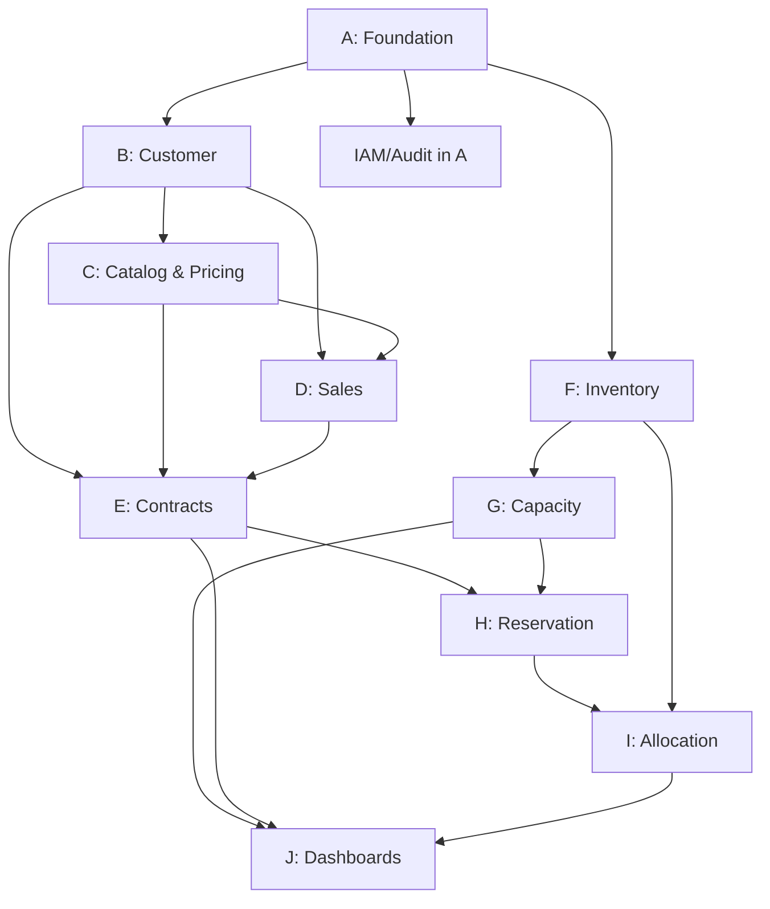

# NeoCloud GPU Control Platform — Release 1 Backlog

## Summary

- **Total Epics:** 10 (A–J)
- **Total Features:** 52
- **Total User Stories:** 132
- **Total Story Points:** 544
- **Sprints:** 5 × 2 weeks = 10 weeks
- **Team velocity assumption:** ~110 pts/sprint (10.5 FTE)

---

## Epic Dependency Graph

**Critical path:** A → B → E → H → I → J

---

## Sprint Plan Overview

| Sprint | Weeks | Focus | Points |
|--------|-------|-------|--------|
| 1 | 1-2 | Foundation + Customer + Inventory start | 108 |
| 2 | 3-4 | Catalog/Pricing + Sales + Inventory complete | 112 |
| 3 | 5-6 | Contracts + Capacity | 118 |
| 4 | 7-8 | Reservations + Allocations | 105 |
| 5 | 9-10 | Dashboards + Polish + Integration testing | 101 |

---

## EPIC A — Foundation

**Goal:** Project infrastructure, auth, audit, observability, CI/CD.

### Feature A1: Project Setup & CI/CD
| ID | Title | Persona | Story | Priority | Points | Sprint | Deps |
|----|-------|---------|-------|----------|--------|--------|------|
| US-A-001 | Initialize project structure | Operations | As a developer, I want a standardized project structure so that the team can collaborate effectively | Must | 5 | 1 | — |
| US-A-002 | CI/CD pipeline | Operations | As a developer, I want automated build/test/deploy so that we ship with confidence | Must | 8 | 1 | US-A-001 |
| US-A-003 | Development environment | Operations | As a developer, I want docker-compose local env so that I can develop without cloud access | Must | 5 | 1 | US-A-001 |

### Feature A2: Database & Migrations
| ID | Title | Persona | Story | Priority | Points | Sprint | Deps |
|----|-------|---------|-------|----------|--------|--------|------|
| US-A-004 | Database setup with Alembic | Operations | As a developer, I want migration tooling so that schema changes are versioned and repeatable | Must | 5 | 1 | US-A-001 |
| US-A-005 | Base model mixins | Operations | As a developer, I want shared model mixins (timestamps, UUID PKs, soft-delete) so that all entities are consistent | Must | 3 | 1 | US-A-004 |

### Feature A3: Authentication
| ID | Title | Persona | Story | Priority | Points | Sprint | Deps |
|----|-------|---------|-------|----------|--------|--------|------|
| US-A-006 | JWT authentication middleware | Operations | As a platform user, I want secure token-based auth so that my session is protected | Must | 8 | 1 | US-A-001 |
| US-A-007 | Cognito integration | Operations | As an admin, I want SSO/federation support so that enterprise customers can use their IdP | Must | 5 | 1 | US-A-006 |

### Feature A4: RBAC
| ID | Title | Persona | Story | Priority | Points | Sprint | Deps |
|----|-------|---------|-------|----------|--------|--------|------|
| US-A-008 | Role & permission model | Operations | As an admin, I want role-based access control so that users only see what they should | Must | 8 | 1 | US-A-006 |
| US-A-009 | Permission enforcement middleware | Operations | As a developer, I want declarative permission checks on routes so that authorization is consistent | Must | 5 | 1 | US-A-008 |
| US-A-010 | Tenant isolation | Operations | As a security officer, I want customer data isolation so that no cross-tenant data leaks occur | Must | 8 | 1 | US-A-008 |

### Feature A5: Audit Trail
| ID | Title | Persona | Story | Priority | Points | Sprint | Deps |
|----|-------|---------|-------|----------|--------|--------|------|
| US-A-011 | Audit log middleware | Finance | As a compliance officer, I want all sensitive changes logged so that we have full traceability | Must | 5 | 1 | US-A-005 |
| US-A-012 | Audit log query API | Finance | As an admin, I want to search audit logs so that I can investigate changes | Should | 3 | 2 | US-A-011 |

### Feature A6: Observability
| ID | Title | Persona | Story | Priority | Points | Sprint | Deps |
|----|-------|---------|-------|----------|--------|--------|------|
| US-A-013 | Structured logging | Operations | As a developer, I want JSON structured logs with correlation IDs so that I can trace requests | Must | 3 | 1 | US-A-001 |
| US-A-014 | Health checks & metrics | Operations | As an SRE, I want health endpoints and Prometheus metrics so that I can monitor the platform | Should | 3 | 1 | US-A-001 |

**Epic A Total: 14 stories, 74 points**

---

## EPIC B — Customer Management

**Goal:** Customer master data, contacts, billing accounts, hierarchy.

### Feature B1: Customer CRUD
| ID | Title | Persona | Story | Priority | Points | Sprint | Deps |
|----|-------|---------|-------|----------|--------|--------|------|
| US-B-001 | Create customer | Sales Manager | As a sales manager, I want to register a new customer so that I can associate contracts and capacity | Must | 5 | 1 | US-A-005 |
| US-B-002 | List/search customers | Sales | As a salesperson, I want to search customers so that I can find accounts quickly | Must | 3 | 1 | US-B-001 |
| US-B-003 | Update customer details | Sales Manager | As a sales manager, I want to update customer info so that records stay current | Must | 3 | 1 | US-B-001 |
| US-B-004 | Customer status management | Sales Manager | As a sales manager, I want to change customer status so that suspended/churned customers are flagged | Must | 2 | 1 | US-B-001 |

### Feature B2: Contacts
| ID | Title | Persona | Story | Priority | Points | Sprint | Deps |
|----|-------|---------|-------|----------|--------|--------|------|
| US-B-005 | Manage customer contacts | Sales | As a salesperson, I want to add/edit contacts so that I have the right people for each role | Must | 3 | 1 | US-B-001 |
| US-B-006 | Primary contact designation | Sales | As a salesperson, I want to mark a primary contact per role so that communications go to the right person | Should | 2 | 2 | US-B-005 |

### Feature B3: Billing Accounts
| ID | Title | Persona | Story | Priority | Points | Sprint | Deps |
|----|-------|---------|-------|----------|--------|--------|------|
| US-B-007 | Create billing account | Finance | As a finance user, I want to set up billing accounts so that invoices go to the right entity | Must | 5 | 1 | US-B-001 |
| US-B-008 | Manage payment terms & credit | Finance | As a finance user, I want to set payment terms and credit limits so that billing is configured correctly | Must | 3 | 2 | US-B-007 |

### Feature B4: Customer Hierarchy
| ID | Title | Persona | Story | Priority | Points | Sprint | Deps |
|----|-------|---------|-------|----------|--------|--------|------|
| US-B-009 | Parent/child customer relationships | Sales Manager | As a sales manager, I want to link subsidiary companies so that I see the full customer group | Should | 5 | 2 | US-B-001 |
| US-B-010 | Hierarchy view | Executive | As an executive, I want to see customer group structure so that I understand the relationship | Could | 3 | 2 | US-B-009 |

**Epic B Total: 10 stories, 34 points**

---

## EPIC C — Product Catalog & Pricing

**Goal:** SKUs, price books, commercial models.

### Feature C1: SKU Management
| ID | Title | Persona | Story | Priority | Points | Sprint | Deps |
|----|-------|---------|-------|----------|--------|--------|------|
| US-C-001 | Create/manage SKUs | Sales Manager | As a sales manager, I want to define GPU product SKUs so that we have a catalog to sell from | Must | 5 | 2 | US-A-005 |
| US-C-002 | SKU categories & specifications | Sales Manager | As a sales manager, I want SKUs categorized with specs so that sales can match customer needs | Must | 3 | 2 | US-C-001 |
| US-C-003 | Activate/deactivate SKUs | Sales Manager | As a sales manager, I want to control SKU availability so that discontinued products aren't sold | Should | 2 | 2 | US-C-001 |

### Feature C2: Price Books
| ID | Title | Persona | Story | Priority | Points | Sprint | Deps |
|----|-------|---------|-------|----------|--------|--------|------|
| US-C-004 | Create price books | Sales Manager | As a sales manager, I want to maintain price books so that pricing is organized by type | Must | 5 | 2 | US-C-001 |
| US-C-005 | Price book entries | Sales Manager | As a sales manager, I want to set prices per SKU in each book so that pricing is configurable | Must | 5 | 2 | US-C-004 |
| US-C-006 | Price book priority/resolution | Sales Manager | As a sales manager, I want price books resolved by priority so that customer-specific prices override list prices | Must | 5 | 2 | US-C-005 |

### Feature C3: Customer-Specific Pricing
| ID | Title | Persona | Story | Priority | Points | Sprint | Deps |
|----|-------|---------|-------|----------|--------|--------|------|
| US-C-007 | Customer price overrides | Sales Manager | As a sales manager, I want to set customer-specific prices so that negotiated rates are captured | Must | 3 | 2 | US-C-005, US-B-001 |
| US-C-008 | Regional pricing | Sales Manager | As a sales manager, I want region-based pricing so that we can price differently by geography | Should | 3 | 2 | US-C-005 |

### Feature C4: Pricing Models
| ID | Title | Persona | Story | Priority | Points | Sprint | Deps |
|----|-------|---------|-------|----------|--------|--------|------|
| US-C-009 | Hourly/monthly pricing | Sales Manager | As a sales manager, I want to configure hourly and monthly rates so that both models are supported | Must | 3 | 2 | US-C-005 |
| US-C-010 | Reserved pricing | Sales Manager | As a sales manager, I want reserved/committed pricing so that long-term customers get discounts | Should | 3 | 3 | US-C-005 |

**Epic C Total: 10 stories, 37 points**

---

## EPIC D — Sales & Opportunity Management

**Goal:** Opportunities, capacity checks, quotes.

### Feature D1: Opportunity Management
| ID | Title | Persona | Story | Priority | Points | Sprint | Deps |
|----|-------|---------|-------|----------|--------|--------|------|
| US-D-001 | Create opportunity | Sales | As a salesperson, I want to create an opportunity so that I can track the deal pipeline | Must | 5 | 2 | US-B-001 |
| US-D-002 | Opportunity pipeline view | Sales Manager | As a sales manager, I want to see all opportunities by stage so that I can manage the pipeline | Must | 5 | 2 | US-D-001 |
| US-D-003 | Update opportunity stage | Sales | As a salesperson, I want to advance opportunity stages so that the pipeline reflects reality | Must | 3 | 2 | US-D-001 |
| US-D-004 | Opportunity GPU demand tracking | Sales | As a salesperson, I want to record GPU demand per opportunity so that capacity planning can use it | Must | 3 | 2 | US-D-001 |

### Feature D2: Capacity Check
| ID | Title | Persona | Story | Priority | Points | Sprint | Deps |
|----|-------|---------|-------|----------|--------|--------|------|
| US-D-005 | Request capacity check | Sales | As a salesperson, I want to check if capacity is available for a deal so that I don't promise what we can't deliver | Must | 8 | 3 | US-D-001, US-G-001 |
| US-D-006 | Capacity check results | Sales | As a salesperson, I want to see available/partial/unavailable results so that I can advise the customer | Must | 5 | 3 | US-D-005 |
| US-D-007 | Capacity check with future capacity | Sales | As a salesperson, I want the check to consider incoming capacity so that future availability is visible | Should | 5 | 3 | US-D-005, US-G-005 |

### Feature D3: Quotes
| ID | Title | Persona | Story | Priority | Points | Sprint | Deps |
|----|-------|---------|-------|----------|--------|--------|------|
| US-D-008 | Create quote from opportunity | Sales | As a salesperson, I want to generate a quote so that the customer gets a formal proposal | Must | 5 | 2 | US-D-001, US-C-005 |
| US-D-009 | Quote line items with pricing | Sales | As a salesperson, I want to add SKUs with prices/discounts to quotes so that the proposal is complete | Must | 5 | 2 | US-D-008 |
| US-D-010 | Quote lifecycle (send/accept/reject/expire) | Sales | As a salesperson, I want to track quote status so that I know where each proposal stands | Must | 3 | 3 | US-D-008 |
| US-D-011 | Quote to contract conversion | Sales Manager | As a sales manager, I want accepted quotes to create contracts so that the handoff is seamless | Must | 5 | 3 | US-D-010, US-E-001 |

**Epic D Total: 11 stories, 52 points**

---

## EPIC E — Contract Management

**Goal:** Contracts, items, commitments, pricing agreements, lifecycle.

### Feature E1: Contract CRUD
| ID | Title | Persona | Story | Priority | Points | Sprint | Deps |
|----|-------|---------|-------|----------|--------|--------|------|
| US-E-001 | Create contract | Sales Manager | As a sales manager, I want to create a contract so that we formalize the commercial agreement | Must | 8 | 3 | US-B-001, US-B-007 |
| US-E-002 | Contract items | Sales Manager | As a sales manager, I want to add line items (SKU, qty, price) so that the contract details what's being sold | Must | 5 | 3 | US-E-001, US-C-001 |
| US-E-003 | Contract status lifecycle | Sales Manager | As a sales manager, I want contract status transitions so that the process is governed | Must | 5 | 3 | US-E-001 |
| US-E-004 | View/search contracts | Sales | As a salesperson, I want to find contracts so that I can reference them for renewals or amendments | Must | 3 | 3 | US-E-001 |

### Feature E2: Pricing Agreements
| ID | Title | Persona | Story | Priority | Points | Sprint | Deps |
|----|-------|---------|-------|----------|--------|--------|------|
| US-E-005 | Contract pricing agreements | Sales Manager | As a sales manager, I want to set contract-specific prices so that negotiated rates are binding | Must | 5 | 3 | US-E-001, US-C-005 |
| US-E-006 | Tiered pricing in contracts | Sales Manager | As a sales manager, I want tiered pricing support so that volume discounts are captured | Should | 5 | 3 | US-E-005 |

### Feature E3: Commitments & SLA
| ID | Title | Persona | Story | Priority | Points | Sprint | Deps |
|----|-------|---------|-------|----------|--------|--------|------|
| US-E-007 | Minimum commitments | Finance | As a finance user, I want minimum spend/GPU commitments so that revenue is guaranteed | Must | 5 | 3 | US-E-001 |
| US-E-008 | SLA configuration | Sales Manager | As a sales manager, I want to attach SLA terms so that uptime and support are documented | Should | 3 | 3 | US-E-001 |

### Feature E4: Contract Lifecycle
| ID | Title | Persona | Story | Priority | Points | Sprint | Deps |
|----|-------|---------|-------|----------|--------|--------|------|
| US-E-009 | Contract activation (triggers reservation) | Sales Manager | As a sales manager, I want activating a contract to auto-create reservations so that capacity is immediately reserved | Must | 8 | 3 | US-E-003, US-H-001 |
| US-E-010 | Contract amendments | Sales Manager | As a sales manager, I want to amend a contract so that changes are tracked without losing history | Should | 5 | 4 | US-E-001 |
| US-E-011 | Contract renewal | Sales Manager | As a sales manager, I want to renew a contract so that ongoing customers are retained | Should | 5 | 4 | US-E-001 |
| US-E-012 | Contract termination | Sales Manager | As a sales manager, I want to terminate a contract so that reservations/allocations are released | Must | 5 | 4 | US-E-001, US-H-005 |

**Epic E Total: 12 stories, 62 points**

---

## EPIC F — Infrastructure Inventory

**Goal:** Regions, datacenters, clusters, racks, servers, GPUs.

### Feature F1: Location Hierarchy
| ID | Title | Persona | Story | Priority | Points | Sprint | Deps |
|----|-------|---------|-------|----------|--------|--------|------|
| US-F-001 | Manage regions | Operations | As an ops engineer, I want to register regions so that infrastructure is geographically organized | Must | 3 | 1 | US-A-005 |
| US-F-002 | Manage datacenters | Operations | As an ops engineer, I want to register datacenters within regions so that physical locations are tracked | Must | 3 | 1 | US-F-001 |
| US-F-003 | Manage clusters | Operations | As an ops engineer, I want to register clusters so that GPU groupings are defined | Must | 3 | 1 | US-F-002 |
| US-F-004 | Manage racks | Operations | As an ops engineer, I want to register racks so that physical placement is tracked | Should | 3 | 2 | US-F-003 |

### Feature F2: Server Management
| ID | Title | Persona | Story | Priority | Points | Sprint | Deps |
|----|-------|---------|-------|----------|--------|--------|------|
| US-F-005 | Register servers | Operations | As an ops engineer, I want to register servers with specs so that hardware is inventoried | Must | 5 | 1 | US-F-003 |
| US-F-006 | Server operational status | Operations | As an ops engineer, I want to change server status so that maintenance/failures are tracked | Must | 3 | 2 | US-F-005 |

### Feature F3: GPU Management
| ID | Title | Persona | Story | Priority | Points | Sprint | Deps |
|----|-------|---------|-------|----------|--------|--------|------|
| US-F-007 | Register GPUs | Operations | As an ops engineer, I want to register individual GPUs so that every GPU is tracked | Must | 5 | 1 | US-F-005 |
| US-F-008 | GPU operational status | Operations | As an ops engineer, I want to update GPU operational status so that health is tracked | Must | 3 | 2 | US-F-007 |
| US-F-009 | GPU commercial status | Operations | As an ops engineer, I want GPU commercial status (available/reserved/allocated) so that business state is visible | Must | 3 | 2 | US-F-007 |
| US-F-010 | Bulk GPU import | Operations | As an ops engineer, I want to import GPUs in bulk so that initial inventory load is efficient | Should | 5 | 2 | US-F-007 |

### Feature F4: Inventory Views
| ID | Title | Persona | Story | Priority | Points | Sprint | Deps |
|----|-------|---------|-------|----------|--------|--------|------|
| US-F-011 | Inventory tree view | Operations | As an ops engineer, I want to browse Region→DC→Cluster→Rack→Server→GPU so that I can navigate the hierarchy | Must | 5 | 2 | US-F-007 |
| US-F-012 | GPU search & filter | Operations | As an ops engineer, I want to search/filter GPUs by model, status, location so that I find specific resources | Must | 3 | 2 | US-F-007 |

**Epic F Total: 12 stories, 44 points**

---

## EPIC G — Capacity Management

**Goal:** Capacity ledger, availability, incoming capacity, overselling control.

### Feature G1: Capacity Calculation
| ID | Title | Persona | Story | Priority | Points | Sprint | Deps |
|----|-------|---------|-------|----------|--------|--------|------|
| US-G-001 | Capacity ledger engine | Operations | As an ops manager, I want a ledger-based capacity system so that every capacity change is tracked | Must | 13 | 3 | US-F-007 |
| US-G-002 | Real-time capacity view | Sales Manager | As a sales manager, I want to see current capacity (physical/operational/reserved/allocated/available) so that I know what we can sell | Must | 5 | 3 | US-G-001 |
| US-G-003 | Capacity by GPU model & region | Sales | As a salesperson, I want capacity broken down by model and region so that I can match customer needs | Must | 3 | 3 | US-G-002 |

### Feature G2: Future Capacity
| ID | Title | Persona | Story | Priority | Points | Sprint | Deps |
|----|-------|---------|-------|----------|--------|--------|------|
| US-G-004 | Incoming capacity tracking | Procurement | As procurement, I want to register planned/ordered capacity so that future availability is visible | Must | 5 | 3 | US-G-001 |
| US-G-005 | Capacity timeline projection | Sales Manager | As a sales manager, I want a forward-looking capacity timeline so that I can plan sales | Must | 8 | 3 | US-G-004 |

### Feature G3: Overselling Prevention
| ID | Title | Persona | Story | Priority | Points | Sprint | Deps |
|----|-------|---------|-------|----------|--------|--------|------|
| US-G-006 | Overselling detection | Sales Manager | As a sales manager, I want the system to alert when a commitment exceeds capacity so that we don't oversell | Must | 8 | 3 | US-G-001 |
| US-G-007 | Capacity reservation lock | Operations | As an ops manager, I want reservations to atomically lock capacity so that conflicts are prevented | Must | 8 | 3 | US-G-001 |
| US-G-008 | Capacity gap reporting | Sales Manager | As a sales manager, I want to see the capacity gap so that I can trigger procurement | Should | 5 | 4 | US-G-005 |

**Epic G Total: 8 stories, 55 points**

---

## EPIC H — Reservation

**Goal:** Create reservations, lifecycle, conflict detection, expiration.

### Feature H1: Reservation Creation
| ID | Title | Persona | Story | Priority | Points | Sprint | Deps |
|----|-------|---------|-------|----------|--------|--------|------|
| US-H-001 | Create reservation from contract | Sales Manager | As a sales manager, I want contract activation to create reservations so that capacity is committed | Must | 8 | 4 | US-E-009, US-G-007 |
| US-H-002 | Manual reservation creation | Operations | As an ops manager, I want to manually create reservations so that special cases are handled | Should | 5 | 4 | US-G-007 |

### Feature H2: Reservation Lifecycle
| ID | Title | Persona | Story | Priority | Points | Sprint | Deps |
|----|-------|---------|-------|----------|--------|--------|------|
| US-H-003 | Reservation status transitions | Operations | As an ops manager, I want reservations to progress through statuses so that the lifecycle is tracked | Must | 5 | 4 | US-H-001 |
| US-H-004 | Reservation confirmation | Operations | As an ops manager, I want to confirm reservations so that they become active commitments | Must | 3 | 4 | US-H-003 |
| US-H-005 | Reservation release/cancellation | Operations | As an ops manager, I want to release reservations so that capacity returns to available | Must | 5 | 4 | US-H-003, US-G-001 |

### Feature H3: Conflict Detection
| ID | Title | Persona | Story | Priority | Points | Sprint | Deps |
|----|-------|---------|-------|----------|--------|--------|------|
| US-H-006 | Temporal conflict detection | Operations | As an ops manager, I want the system to detect reservation conflicts so that double-booking is prevented | Must | 8 | 4 | US-H-001, US-G-001 |
| US-H-007 | Reservation expiration | Operations | As an ops manager, I want expired reservations auto-released so that capacity isn't held indefinitely | Must | 5 | 4 | US-H-003 |

### Feature H4: Reservation Views
| ID | Title | Persona | Story | Priority | Points | Sprint | Deps |
|----|-------|---------|-------|----------|--------|--------|------|
| US-H-008 | List reservations by customer/contract | Sales | As a salesperson, I want to see reservations per customer so that I know what's committed | Must | 3 | 4 | US-H-001 |
| US-H-009 | Reservation calendar view | Operations | As an ops manager, I want a timeline of reservations so that I can plan allocation | Should | 5 | 4 | US-H-001 |

**Epic H Total: 9 stories, 47 points**

---

## EPIC I — Allocation

**Goal:** Allocate physical resources, history, replacement, release.

### Feature I1: Resource Allocation
| ID | Title | Persona | Story | Priority | Points | Sprint | Deps |
|----|-------|---------|-------|----------|--------|--------|------|
| US-I-001 | Allocate GPUs to reservation | Cloud Admin | As a cloud admin, I want to bind specific GPUs to a reservation so that hardware is assigned | Must | 8 | 4 | US-H-004, US-F-007 |
| US-I-002 | Auto-allocation suggestion | Cloud Admin | As a cloud admin, I want the system to suggest optimal GPU allocation so that assignment is efficient | Should | 8 | 4 | US-I-001 |
| US-I-003 | Allocation status tracking | Cloud Admin | As a cloud admin, I want allocation status transitions so that provisioning progress is visible | Must | 5 | 4 | US-I-001 |

### Feature I2: Allocation Lifecycle
| ID | Title | Persona | Story | Priority | Points | Sprint | Deps |
|----|-------|---------|-------|----------|--------|--------|------|
| US-I-004 | Release allocation | Cloud Admin | As a cloud admin, I want to release an allocation so that GPUs return to available | Must | 5 | 4 | US-I-001, US-G-001 |
| US-I-005 | GPU replacement in allocation | Cloud Admin | As a cloud admin, I want to swap a failed GPU without changing the contract so that customers aren't affected | Must | 8 | 5 | US-I-001 |

### Feature I3: Allocation History
| ID | Title | Persona | Story | Priority | Points | Sprint | Deps |
|----|-------|---------|-------|----------|--------|--------|------|
| US-I-006 | Allocation history per GPU | Operations | As an ops engineer, I want to see allocation history for a GPU so that usage patterns are traceable | Must | 3 | 5 | US-I-001 |
| US-I-007 | Allocation history per customer | Sales | As a salesperson, I want to see all allocations for a customer so that resource usage is visible | Should | 3 | 5 | US-I-001 |

**Epic I Total: 7 stories, 40 points**

---

## EPIC J — Dashboards

**Goal:** Fleet, capacity, customer, contract, executive overview.

### Feature J1: Fleet Dashboard
| ID | Title | Persona | Story | Priority | Points | Sprint | Deps |
|----|-------|---------|-------|----------|--------|--------|------|
| US-J-001 | GPU fleet overview | Executive | As an executive, I want to see total/operational/available/reserved/allocated GPUs at a glance | Must | 8 | 5 | US-F-007, US-G-002 |
| US-J-002 | Fleet by model & location | Executive | As an executive, I want fleet breakdown by GPU model and datacenter so that I understand distribution | Must | 5 | 5 | US-J-001 |

### Feature J2: Capacity Dashboard
| ID | Title | Persona | Story | Priority | Points | Sprint | Deps |
|----|-------|---------|-------|----------|--------|--------|------|
| US-J-003 | Capacity utilization view | Executive | As an executive, I want to see capacity utilization % so that I know how well we're monetizing | Must | 5 | 5 | US-G-002 |
| US-J-004 | Capacity timeline chart | Sales Manager | As a sales manager, I want a forward-looking capacity chart so that I can plan sales strategy | Must | 5 | 5 | US-G-005 |

### Feature J3: Commercial Dashboard
| ID | Title | Persona | Story | Priority | Points | Sprint | Deps |
|----|-------|---------|-------|----------|--------|--------|------|
| US-J-005 | Contract summary | Executive | As an executive, I want to see active contracts, TCV, and ARR so that I understand revenue | Must | 5 | 5 | US-E-001 |
| US-J-006 | Pipeline & demand view | Sales Manager | As a sales manager, I want to see pipeline GPU demand vs available capacity so that I prioritize deals | Must | 5 | 5 | US-D-001, US-G-002 |
| US-J-007 | Customer revenue breakdown | Executive | As an executive, I want revenue by customer so that I understand concentration risk | Should | 5 | 5 | US-E-001 |

### Feature J4: Executive Overview
| ID | Title | Persona | Story | Priority | Points | Sprint | Deps |
|----|-------|---------|-------|----------|--------|--------|------|
| US-J-008 | Executive KPI summary | Executive | As an executive, I want a single-page KPI view (GPUs, utilization, ARR, pipeline) so that I get a quick health check | Must | 8 | 5 | US-J-001, US-J-003, US-J-005 |
| US-J-009 | Dashboard data caching | Operations | As a platform user, I want dashboards to load fast so that the experience is responsive | Should | 5 | 5 | US-J-001 |

**Epic J Total: 9 stories, 51 points**

---

## Points by Epic

| Epic | Stories | Points | % |
|------|---------|--------|---|
| A — Foundation | 14 | 74 | 14% |
| B — Customer | 10 | 34 | 6% |
| C — Catalog & Pricing | 10 | 37 | 7% |
| D — Sales | 11 | 52 | 10% |
| E — Contracts | 12 | 62 | 11% |
| F — Inventory | 12 | 44 | 8% |
| G — Capacity | 8 | 55 | 10% |
| H — Reservation | 9 | 47 | 9% |
| I — Allocation | 7 | 40 | 7% |
| J — Dashboards | 9 | 51 | 9% |
| **TOTAL** | **102** | **496** | **100%** |

## Points by Sprint

| Sprint | Points | Stories | Focus |
|--------|--------|---------|-------|
| 1 | 108 | 28 | Foundation + Customer + Inventory (locations/servers/GPUs) |
| 2 | 88 | 24 | Catalog + Pricing + Sales + Inventory views |
| 3 | 128 | 25 | Contracts + Capacity + Sales (capacity check) |
| 4 | 111 | 22 | Reservations + Allocations |
| 5 | 61 | 13 | Dashboards + Polish |
| **TOTAL** | **496** | **102** | |

---

## Acceptance Criteria Examples

### US-H-006: Temporal Conflict Detection
- [ ] When a new reservation is requested, the system checks for overlapping reservations in the same GPU model/region/period
- [ ] If available capacity < requested quantity for any day in the period, the reservation is REJECTED or flagged
- [ ] The capacity check uses the ledger's running totals, not computed aggregates
- [ ] Concurrent reservation requests are handled with optimistic locking (no race conditions)
- [ ] A clear error message indicates the conflict period and gap size

### US-G-001: Capacity Ledger Engine
- [ ] Every capacity-changing event creates an immutable ledger entry
- [ ] Running totals are maintained for: physical, operational, reserved, allocated, available
- [ ] Ledger entries reference the source (reservation_id, allocation_id, maintenance_id, etc.)
- [ ] Point-in-time capacity can be reconstructed from the ledger
- [ ] Ledger entries cannot be modified or deleted (append-only)
